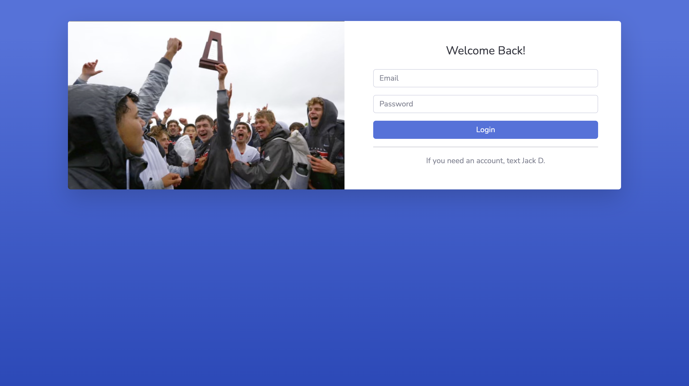
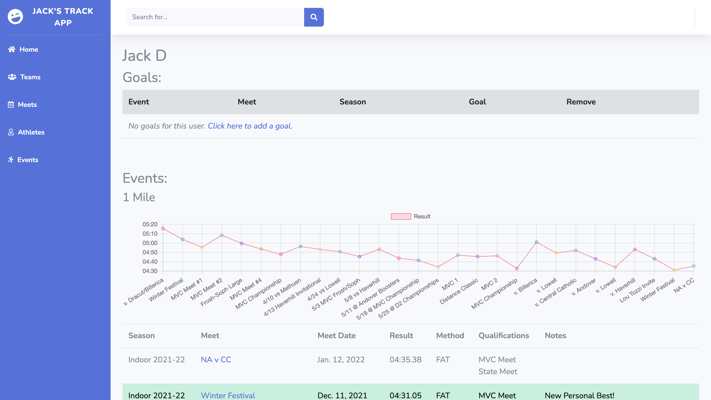
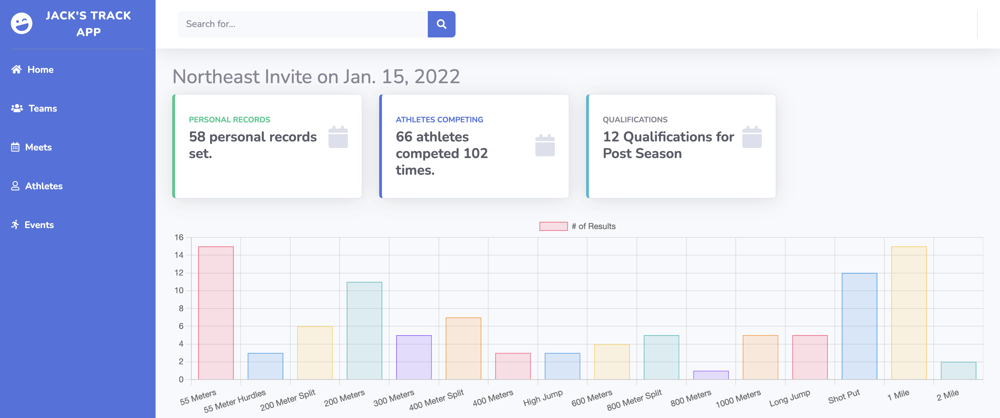

# Trackapp Web Application.

### Visit my Track Web Application [Here](https://natrackstats.com/)!

Used Django, HTML, Python, and Javascript to create a web application to perform data analytics on over a decade of track and field data processed from results spreadsheets. Used visualizations to communicate improvements over time, and integrated qualification standards and performance milestones to highlight individual accomplishments. Used by coaches to track individual growth as well as teamwide participation, meet results, and historic performances.

Some cool parts:

##### Login Page:

 

##### Example ( My slightly outdated ;) ) Athlete Page:

 

##### Example Meet Page:

